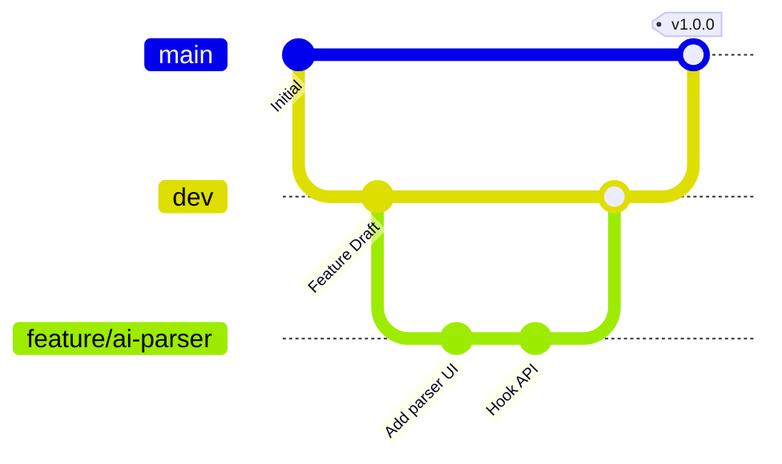

# TASK - Elegant AI-Assisted Project Manager

<div align="center">
  <p style="font-size: 18px; white-space: nowrap;"><strong>Sleek, lightweight, and AI-assisted project navigator based on the T-A-S-K methodology.</strong></p>

  <p>
    Built with <strong>Vue 3</strong>, <strong>TypeScript</strong>, <strong>Pinia</strong>, and <strong>Tauri / Rust</strong>.
  </p>
</div>

---

## 🌟 Why TASK?

Traditional project managers are often bloated, overly complex, or lack structured execution. **TASK** is designed around a clean, four-stage lifecycle (**T-A-S-K**) that transforms raw ideas into concrete, archived value:

<table>
  <tr>
    <td width="50%">
      <h3>🎯 T - TARGET (Goal Setting)</h3>
      <p>Define clear project directions, core targets, and interactive milestones. Track your high-level progress with granular completion states.</p>
    </td>
    <td width="50%">
      <h3>⚡ A - ACTION (Execution)</h3>
      <p>Deconstruct targets into action cards. Prioritize tasks, set due dates, and manage your daily todo workflow via an interactive drag-and-drop dashboard.</p>
    </td>
  </tr>
  <tr>
    <td>
      <h3>🤝 S - SERVE (Value Delivery)</h3>
      <p>Evaluate and summarize the actual value delivered to your clients or stakeholders. Document your deliverables to ensure high-quality service.</p>
    </td>
    <td>
      <h3>📦 K - KEEP (Archival & Legacy)</h3>
      <p>Save and organize core project assets, links, files, and templates. Ensure your learnings and final deliverables are preserved for future reference.</p>
    </td>
  </tr>
</table>

---

## ✨ Key Features

- **🤖 AI Requirement Parser**: Type out a messy, brain-dumped project idea, and the built-in AI assistant will parse it into structured Targets and Actions in seconds.
- **🗺️ Interactive Steps Roadmap**: A premium, dynamic navigation banner tracking the real-time status of your project lifecycle (T ➔ A ➔ S ➔ K).
- **🎨 Premium Visual Design**: Built with high-fidelity dark modes, custom HSL color systems, elegant gradients, and interactive micro-animations.
- **⚡ Native & Web Dual Support**: Ships as a native desktop application (powered by Tauri) and also runs flawlessly inside the browser.

---

## 🌿 Branching Strategy & Workflow

To maintain code quality and deployment safety, this repository uses the following branching model:



- **`main`**: Production-ready stable branch. Contains only thoroughly tested release-ready commits.
- **`dev`**: Daily integration and development branch. All feature branches merge here for integration testing.
- **`feature/*`**: Feature-specific branches (e.g., `feature/custom-model`).
- **`bugfix/*` / `hotfix/*`**: Bug resolution branches.

---

## 🛠️ Technical Stack

- **Frontend**: Vue 3 (Composition API), Vite, TypeScript, Pinia, TailwindCSS
- **Desktop Runtime**: Tauri (v2), Rust
- **Editor & Autocomplete**: CodeMirror 6
- **Formatting**: Oxlint & Oxfmt (for lightning-fast linting/formatting)

---

## 🚀 Getting Started

### Prerequisites

Ensure you have **Node.js (>= 22.13.0)** and **pnpm** installed.

### Installation

Clone the repository and install dependencies:

```bash
pnpm install
```

### Running Locally

To start the local web development server:

```bash
pnpm dev:web
```

To run the desktop application locally (Tauri development environment required):

```bash
pnpm dev:tauri
```

### Build & Package

To build and compile frontend assets:

```bash
pnpm build
```

To package the production desktop application:

```bash
pnpm tauri build
```

---

## 📄 License

This project is licensed under the Apache-2.0 License - see the [LICENSE](LICENSE) file for details.
