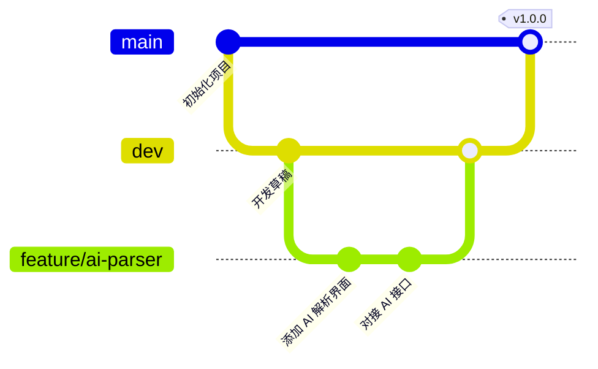

# TASK - 优雅的 AI 辅助项目执行管理器

<div align="center">
  <p style="font-size: 18px; white-space: nowrap;"><strong>基于 T-A-S-K 方法论的高效、轻量且具备 AI 智能辅助的项目执行导航系统。</strong></p>

  <p>
    基于 <strong>Vue 3</strong>、<strong>TypeScript</strong>、<strong>Pinia</strong> 以及 <strong>Tauri / Rust</strong> 构建。
  </p>
</div>

---

## 🌟 什么是 T-A-S-K 方法论？

传统的项目管理软件往往过于臃肿，或缺乏闭环的执行逻辑。**TASK** 专为个人及小团队设计，将项目的生命周期划分为清晰的四个阶段（**T-A-S-K**），帮助你将脑海中的想法转化为真正的价值沉淀：

<table>
  <tr>
    <td width="50%">
      <h3>🎯 T - TARGET (明确目标)</h3>
      <p>立项之本。定义项目的宏观方向，设定明确的核心目标与交互式里程碑（Milestones），全局把控项目达成率。</p>
    </td>
    <td width="50%">
      <h3>⚡ A - ACTION (拆解行动)</h3>
      <p>执行之翼。将总目标拆解为具体的行动卡片，设置优先级与截止日期，通过可视化的看板管理每日待办事项与进度。</p>
    </td>
  </tr>
  <tr>
    <td>
      <h3>🤝 S - SERVE (价值服务)</h3>
      <p>交付之果。客观归纳与总结项目为用户、客户或自身带来的核心交付价值与实际成果，确保服务质量。</p>
    </td>
    <td>
      <h3>📦 K - KEEP (沉淀资产)</h3>
      <p>传承之基。归档项目过程中产出的核心文件、关键链接、代码资产和复盘文档，为未来的项目提供宝贵遗产。</p>
    </td>
  </tr>
</table>

---

## ✨ 核心特性

- **🤖 AI 需求智能解析**：只需随意输入一段杂乱的创意、构想或会议纪要，内置的 AI 助手即可在数秒内将其智能拆解为结构化的“目标”与“行动”并一键导入。
- **🗺️ 互动步骤线路图**：位于顶部视口的精致动态导航栏，实时计算并展示项目生命周期（T ➔ A ➔ S ➔ K）的完成状态与进度百分比。
- **🎨 极佳的视觉美学**：采用精心设计的暗黑/明亮双模式，结合 HSL 微调色彩系统、微动效与过渡模糊，带来极佳的交互体验。
- **⚡ 双端运行支持**：既可通过 Tauri 打包为极轻量（约 15 MB 运行内存占用极低）的跨平台桌面客户端，也可直接在浏览器中作为 Web 应用运行。

---

## 🌿 Git 分支管理策略

为了规范代码提交与保障版本发布安全，本项目推荐使用以下 Git 分支开发流：



- **`main`**：生产环境稳定分支。只合并经过严格测试的发布版本代码。
- **`dev`**：日常集成与开发主分支。所有的功能分支在此进行合并和联调测试。
- **`feature/*`**：独立功能开发分支（如：`feature/custom-model`）。
- **`bugfix/*` / `hotfix/*`**：缺陷修复与紧急线上补丁分支。

---

## 🛠️ 核心技术栈

- **前端框架**：Vue 3 (Composition API / `<script setup>`), Vite, TypeScript, Pinia, TailwindCSS
- **桌面端壳**：Tauri (v2), Rust
- **编辑器组件**：CodeMirror 6
- **代码规范**：Oxlint & Oxfmt (极速 Lint 与代码美化工具)

---

## 🚀 快速开始

### 前提条件

请确保您本地已安装 **Node.js (>= 22.13.0)** 和 **pnpm** 包管理器。

### 安装依赖

克隆本仓库后，在根目录下执行：

```bash
pnpm install
```

### 本地开发

运行 Web 端开发服务：

```bash
pnpm dev:web
```

运行桌面客户端开发服务（需搭建好 Rust 与 Tauri 开发环境）：

```bash
pnpm dev:tauri
```

### 构建与打包

仅构建前端 Web 静态资源：

```bash
pnpm build
```

打包生成生产环境桌面客户端：

```bash
pnpm tauri build
```

---

## 📄 开源协议

本项目基于 Apache-2.0 协议开源，详情请参阅 [LICENSE](LICENSE) 文件。
